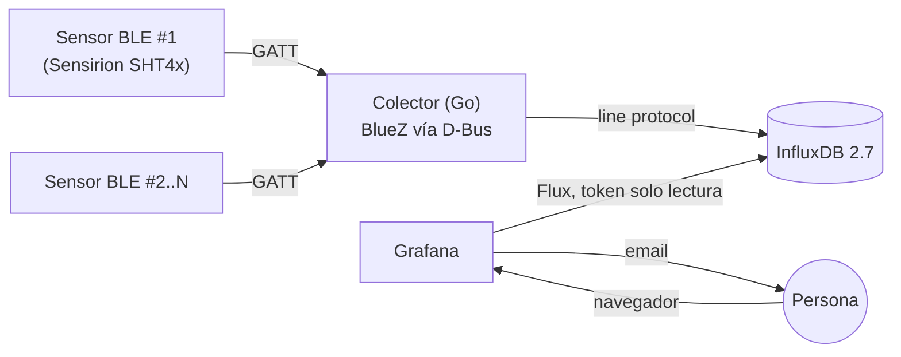

# CPD Monitor

[](https://github.com/alexio9910/cpd-monitor/actions/workflows/build.yml)
[](go.mod)
[](LICENSE)

Monitorización ambiental de un CPD — temperatura y humedad en tiempo real,
con alertas automáticas y un log de eventos del propio colector — usando
sensores Bluetooth **Sensirion SHT4x Smart Gadget**, un colector en
**Go**, **InfluxDB** como base de datos de series temporales y
**Grafana** para visualización y alertado. Todo autoalojado, sin
dependencias externas salvo el envío de email.

## 🛠️ Stack


## 📚 Documentación

| Documento | Para qué |
|---|---|
| **[docs/GUIA-DESDE-CERO.md](docs/GUIA-DESDE-CERO.md)** | Despliegue guiado paso a paso, sin dar nada por sabido — de una Raspberry Pi en blanco a producción. |
| **[docs/MANUAL-EXPERTO.md](docs/MANUAL-EXPERTO.md)** | Referencia de uso diario: leer el dashboard, gestionar alertas/usuarios, diagnosticar fallos, añadir/quitar sensores. |
| **[docs/ALERTAS.md](docs/ALERTAS.md)** | Configuración exacta de las 4 reglas de alerta, por qué está cada cosa como está, e historial completo de bugs encontrados y resueltos. |
| **[docs/ARQUITECTURA.md](docs/ARQUITECTURA.md)** | Decisiones de diseño y por qué se descartaron las alternativas. |
| **[docs/MEJORAS-FUTURAS.md](docs/MEJORAS-FUTURAS.md)** | Roadmap de mejoras pendientes. |
| **[CHANGELOG.md](CHANGELOG.md)** | Historial cronológico de cambios significativos del proyecto. |

Este README es la ficha técnica: arquitectura, características y comandos
esenciales. Para el despliegue guiado o la operación del día a día, usa
los documentos de arriba.

## Arquitectura



| Capa | Tecnología | Por qué |
|---|---|---|
| Lectura de sensores | Go + `github.com/godbus/dbus` | Habla con BlueZ directamente por D-Bus — evita un bug de compatibilidad sin resolver en librerías BLE de abstracción con BlueZ ≥5.55. |
| Ejecución del colector | systemd (nativo, no contenerizado) | BLE necesita acceso directo al adaptador del host; systemd da arranque automático y reinicio ante fallos sin exponer D-Bus/Bluetooth a un contenedor. |
| Base de datos | InfluxDB OSS 2.7 (Docker) | Sin límite de rango de consultas (a diferencia de InfluxDB 3 Core en su edición gratuita) — ideal para histórico de meses. Guarda tanto las lecturas (`cpd_ambiente`) como el log de eventos del colector (`cpd_eventos`). |
| Visualización y alertas | Grafana (Docker) | Dashboard + motor de alertas nativo, con *provisioning* por fichero (datasource, dashboard, contact point **y reglas de alerta**) — nada crítico depende ya de configuración manual en la UI. |

Detalle completo de cada decisión: [`docs/ARQUITECTURA.md`](docs/ARQUITECTURA.md).

## ✨ Características

- **Multi-sensor**, sin límite práctico — añadir o quitar uno es un solo comando (`scripts/gestionar_sensor.py`).
- **Conexión BLE persistente por sensor**, con reconexión y auto-descubrimiento automáticos tras un reinicio del host.
- **Seguridad por defecto**: token de InfluxDB de solo lectura para el datasource de Grafana (no el de administrador); usuario `visor` de solo consulta.
- **Alertas por email en 4 tipos**, todas provisionadas por fichero: temperatura y humedad fuera de rango, batería baja, y un *watchdog* de "sin datos" que calcula el tiempo transcurrido desde la última lectura de cada sensor — cubre automáticamente cualquier sensor presente o futuro, sin mantenimiento manual.
- **Dashboard organizado en secciones plegables**: gráficas generales, estado de alertas, un bloque por sensor (temperatura/humedad/batería), y un log de eventos del colector.
- **Log de eventos del colector** (`cpd_eventos` en InfluxDB): cada conexión/desconexión BLE queda registrada con motivo y duración, visible en el dashboard sin entrar por SSH.
- **Todo provisionado por fichero** — datasource, dashboard, contact point y las 4 reglas de alerta se recrean solos al levantar el stack; sobreviven a un `docker compose down -v`.
- **Cero dependencias externas** salvo el envío de correo — sin nube, sin telemetría de terceros.

## 🚀 Inicio rápido

> Para el detalle de cada paso (y la resolución de problemas típicos),
> sigue [`docs/GUIA-DESDE-CERO.md`](docs/GUIA-DESDE-CERO.md). Esto es el
> resumen para quien ya sabe lo que hace.

**Requisitos**: Linux con BlueZ · Go 1.22+ · Docker + Compose.

```bash
git clone git@github.com:alexio9910/cpd-monitor.git
cd cpd-monitor

# Sensores: identifica cada MAC con `bluetoothctl` (scan on / scan off)
cp config.example.yaml config.yaml   # rellena "sensores:" con tus MAC reales

# Stack (InfluxDB + Grafana), con GF_SERVER_ROOT_URL apuntando a tu IP real
cp .env.example .env                 # rellena las variables (comentadas en el propio fichero)
docker compose up -d

# Colector, como servicio systemd
make build
sudo useradd --system --no-create-home --shell /usr/sbin/nologin cpdmonitor
sudo usermod -aG bluetooth cpdmonitor
sudo mkdir -p /opt/cpd-monitor
sudo cp bin/cpd-monitor config.yaml /opt/cpd-monitor/
sudo chown -R cpdmonitor:cpdmonitor /opt/cpd-monitor
sudo cp deploy/systemd/cpd-monitor.service /etc/systemd/system/
sudo systemctl daemon-reload
sudo systemctl enable --now cpd-monitor
```

Verifica: `journalctl -u cpd-monitor -f` y `http://IP_DE_TU_PI:3000` (dashboard **"CPD - Temperatura y Humedad"**).

## 🔒 Seguridad

- El datasource de Grafana usa un **token de InfluxDB de solo lectura**, nunca el de administrador.
- Usuario `visor` (rol *Viewer*) para dar acceso de solo consulta sin permisos de edición.
- `config.yaml` y `.env` (secretos reales) nunca se suben al repositorio — están en `.gitignore`.
- Si expones Grafana fuera de tu red local, ponlo detrás de un proxy inverso con HTTPS.

Cómo crear el token/usuario, paso a paso: [`docs/MANUAL-EXPERTO.md`, sección 6](docs/MANUAL-EXPERTO.md).

## 🔔 Alertas

| Regla | Dispara cuando | Frecuencia |
|---|---|---|
| Temperatura fuera de rango | 18–33 °C | Inmediato, cada 30 min mientras persista |
| Humedad fuera de rango | 25–60 %HR | Inmediato, cada 30 min mientras persista |
| Batería baja | <10% en algún sensor | Cada 30 min mientras persista |
| Sensor sin datos | >10 min sin lectura de ese sensor | Un único aviso hasta que se recupera |

Las 4 reglas están **provisionadas por fichero**
(`grafana/provisioning/alerting/rules.yaml`) y cubren automáticamente
cualquier sensor configurado, sin tocar nada al añadir uno nuevo. Detalle
exacto de cada regla, por qué está cada umbral/tiempo como está, y el
historial de bugs cazados por el camino: [`docs/ALERTAS.md`](docs/ALERTAS.md).

## ➕ Añadir o quitar un sensor

```bash
python3 scripts/gestionar_sensor.py añadir sensor3 "AA:BB:CC:DD:EE:FF" "Sensor 3"
# o, para quitar uno:
python3 scripts/gestionar_sensor.py quitar sensor3
```

Un único comando gestiona `config.yaml` y los paneles del dashboard a la
vez; las alertas ya cubren cualquier sensor sin cambios. Detalle
completo: [`docs/MANUAL-EXPERTO.md`, sección 7](docs/MANUAL-EXPERTO.md).

## 🩺 Si algo falla

| Síntoma | Mira aquí |
|---|---|
| Herramientas, Git/GitHub, el colector no lee el sensor, systemd no arranca | `docs/GUIA-DESDE-CERO.md`, Fase 12 |
| Grafana sin datos, alertas que no llegan, usuarios, IP fija | `docs/MANUAL-EXPERTO.md`, sección 9 |
| Dudas sobre una alerta concreta (umbral, tiempos, por qué se comporta así) | `docs/ALERTAS.md` |

## Estructura del repositorio

```
cpd-monitor/
├── cmd/collector/main.go        # punto de entrada del colector
├── internal/
│   ├── config/                  # carga de config.yaml
│   ├── sensor/                  # lectura BLE (habla con BlueZ por D-Bus)
│   └── store/                   # escritura en InfluxDB (lecturas + log de eventos)
├── scripts/
│   └── gestionar_sensor.py      # añade/quita un sensor: config.yaml + dashboard
├── config.example.yaml
├── docker-compose.yml           # InfluxDB + Grafana
├── grafana/
│   ├── provisioning/
│   │   ├── datasources/          # datasource InfluxDB (token solo lectura)
│   │   ├── dashboards/           # proveedor del dashboard
│   │   └── alerting/             # contact point, política, y las 4 reglas
│   └── dashboards/               # JSON del dashboard
├── deploy/systemd/               # unidad systemd, espera a InfluxDB, config de journald
├── deploy.sh                     # despliega desde tu máquina de desarrollo
├── docs/
│   ├── GUIA-DESDE-CERO.md
│   ├── MANUAL-EXPERTO.md
│   ├── ALERTAS.md
│   ├── ARQUITECTURA.md
│   └── MEJORAS-FUTURAS.md
├── go.mod / go.sum
├── LICENSE
├── Makefile
├── CHANGELOG.md
└── .github/workflows/build.yml   # CI: compila y valida en cada push
```

## Licencia

[MIT](LICENSE)
