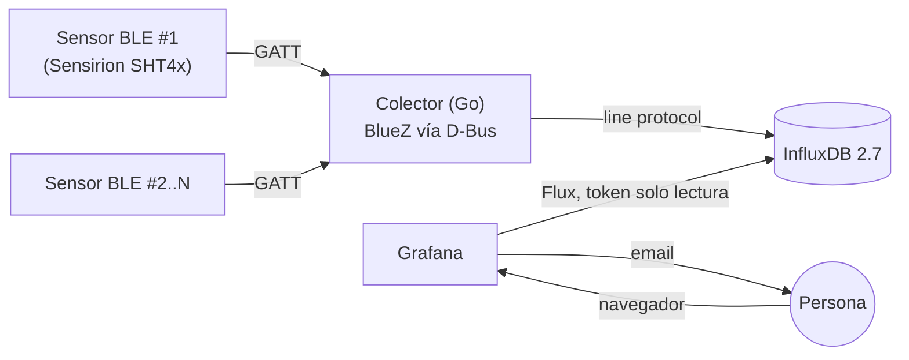

# CPD Monitor

[](https://github.com/alexio9910/cpd-monitor/actions/workflows/build.yml)
[](go.mod)
[](LICENSE)

Monitorización ambiental de un CPD — temperatura y humedad en tiempo real,
con alertas automáticas — usando sensores Bluetooth **Sensirion SHT4x
Smart Gadget**, un colector en **Go**, **InfluxDB** como base de datos de
series temporales y **Grafana** para visualización y alertado. Todo
autoalojado, sin dependencias externas salvo el envío de email.

## 📚 Documentación

| Documento | Para qué |
|---|---|
| **[docs/GUIA-DESDE-CERO.md](docs/GUIA-DESDE-CERO.md)** | Despliegue guiado paso a paso, sin dar nada por sabido — de una Raspberry Pi en blanco a producción. |
| **[docs/MANUAL-EXPERTO.md](docs/MANUAL-EXPERTO.md)** | Referencia de uso diario: leer el dashboard, gestionar alertas/usuarios, diagnosticar fallos, añadir sensores. |
| **[docs/ARQUITECTURA.md](docs/ARQUITECTURA.md)** | Decisiones de diseño y por qué se descartaron las alternativas. |
| **[docs/MEJORAS-FUTURAS.md](docs/MEJORAS-FUTURAS.md)** | Roadmap de mejoras pendientes. |

Este README es la ficha técnica: arquitectura, características y comandos
esenciales. Para el despliegue guiado o la operación del día a día, usa
los documentos de arriba.

## Arquitectura



| Capa | Tecnología | Por qué |
|---|---|---|
| Lectura de sensores | Go + `github.com/godbus/dbus` | Habla con BlueZ directamente por D-Bus — evita un bug de compatibilidad sin resolver en librerías BLE de abstracción con BlueZ ≥5.55. |
| Ejecución del colector | systemd (nativo, no contenerizado) | BLE necesita acceso directo al adaptador del host; systemd da arranque automático y reinicio ante fallos sin exponer D-Bus/Bluetooth a un contenedor. |
| Base de datos | InfluxDB OSS 2.7 (Docker) | Sin límite de rango de consultas (a diferencia de InfluxDB 3 Core en su edición gratuita) — ideal para histórico de meses. |
| Visualización y alertas | Grafana (Docker) | Dashboard + motor de alertas nativo, con *provisioning* por fichero (datasource, dashboard, contact point) — nada se configura a mano en la UI salvo las reglas de alerta. |

Detalle completo de cada decisión: [`docs/ARQUITECTURA.md`](docs/ARQUITECTURA.md).

## ✨ Características

- **Multi-sensor**, sin límite práctico — añadir uno nuevo es editar un YAML y ejecutar un script.
- **Conexión BLE persistente por sensor**, con reconexión y auto-descubrimiento automáticos tras un reinicio del host.
- **Seguridad por defecto**: token de InfluxDB de solo lectura para el datasource de Grafana (no el de administrador); usuario `visor` de solo consulta.
- **Alertas por email en 3 estados**: fuera de rango (inmediato), vuelta a la normalidad (automático), y *watchdog* de "sin datos" si el propio colector deja de responder.
- **Todo provisionado por fichero** — datasource, dashboard y contact point de alertas se recrean solos al levantar el stack.
- **Cero dependencias externas** salvo el envío de correo — sin nube, sin telemetría de terceros.

## 🚀 Inicio rápido

> Para el detalle de cada paso (y la resolución de problemas típicos),
> sigue [`docs/GUIA-DESDE-CERO.md`](docs/GUIA-DESDE-CERO.md). Esto es el
> resumen para quien ya sabe lo que hace.

**Requisitos**: Linux con BlueZ · Go 1.22+ · Docker + Compose.

```bash
git clone git@github.com:alexio9910/cpd-monitor.git
# (si vas a usar este proyecto como base para el tuyo, sustituye por tu propio usuario/organización)
cd cpd-monitor

# Sensores: identifica cada MAC con `bluetoothctl` (scan on / scan off)
cp config.example.yaml config.yaml   # rellena "sensores:" con tus MAC reales

# Stack (InfluxDB + Grafana)
cp .env.example .env                 # rellena las variables (comentadas en el propio fichero)
docker compose up -d

# Token de InfluxDB de solo lectura para Grafana — OBLIGATORIO, sin esto
# el dashboard arranca vacío. Comando exacto: GUIA-DESDE-CERO.md Fase 7.2
docker compose up -d --force-recreate grafana

# Colector, como servicio systemd
make build
sudo useradd --system --no-create-home --shell /usr/sbin/nologin cpdmonitor
sudo usermod -aG bluetooth cpdmonitor
sudo mkdir -p /opt/cpd-monitor
sudo cp bin/cpd-monitor config.yaml /opt/cpd-monitor/
sudo chown -R cpdmonitor:cpdmonitor /opt/cpd-monitor
sudo cp deploy/systemd/cpd-monitor.service /etc/systemd/system/
sudo systemctl daemon-reload
sudo systemctl enable --now cpd-monitor
```

Verifica: `journalctl -u cpd-monitor -f` y `http://localhost:3000` (dashboard **"CPD - Temperatura y Humedad"**).

## 🔒 Seguridad

- El datasource de Grafana usa un **token de InfluxDB de solo lectura**, nunca el de administrador.
- Usuario `visor` (rol *Viewer*) para dar acceso de solo consulta sin permisos de edición.
- `config.yaml` y `.env` (secretos reales) nunca se suben al repositorio — están en `.gitignore`.
- Si expones Grafana fuera de tu red local, ponlo detrás de un proxy inverso con HTTPS.

Cómo crear el token/usuario, paso a paso: [`docs/MANUAL-EXPERTO.md`, sección 6](docs/MANUAL-EXPERTO.md).

## 🔔 Alertas

| Regla | Rango normal |
|---|---|
| Temperatura | 18–27 °C (orientativo ASHRAE TC9.9) |
| Humedad relativa | 40–60 %HR |

Tres avisos por email, sin intervención manual: **fuera de rango** (al
instante), **vuelta a la normalidad** (automático), y **watchdog** si el
colector deja de mandar datos. Configuración y umbrales:
[`docs/MANUAL-EXPERTO.md`, sección 3](docs/MANUAL-EXPERTO.md).

## ➕ Añadir un sensor

```bash
# 1. Añade el bloque del sensor a config.yaml, cópialo a /opt y reinicia el servicio.
# 2. Genera sus paneles del dashboard automáticamente:
python3 scripts/anadir_sensor_dashboard.py sensor2 "Sensor 2"
docker compose restart grafana
```

Detalle completo: [`docs/MANUAL-EXPERTO.md`, sección 7](docs/MANUAL-EXPERTO.md).

## 🩺 Si algo falla

| Síntoma | Mira aquí |
|---|---|
| Herramientas, Git/GitHub, el colector no lee el sensor, systemd no arranca | `docs/GUIA-DESDE-CERO.md`, Fase 12 |
| Grafana sin datos, alertas que no llegan, usuarios, IP fija | `docs/MANUAL-EXPERTO.md`, sección 9 |

## Estructura del repositorio

```
cpd-monitor/
├── cmd/collector/main.go        # punto de entrada del colector
├── internal/
│   ├── config/                  # carga de config.yaml
│   ├── sensor/                  # lectura BLE (habla con BlueZ por D-Bus)
│   └── store/                   # escritura en InfluxDB
├── scripts/
│   └── anadir_sensor_dashboard.py  # añade los paneles de un sensor nuevo
├── config.example.yaml
├── docker-compose.yml           # InfluxDB + Grafana
├── grafana/
│   ├── provisioning/
│   │   ├── datasources/          # datasource InfluxDB (token solo lectura)
│   │   ├── dashboards/           # proveedor del dashboard
│   │   └── alerting/             # contact point (email) y política
│   └── dashboards/               # JSON del dashboard
├── deploy/systemd/               # unidad systemd del colector
├── deploy.sh                     # despliega desde tu máquina de desarrollo
├── docs/
│   ├── GUIA-DESDE-CERO.md
│   ├── MANUAL-EXPERTO.md
│   ├── ARQUITECTURA.md
│   └── MEJORAS-FUTURAS.md
└── .github/workflows/build.yml   # CI: compila y valida en cada push
```

## Licencia

[MIT](LICENSE)
