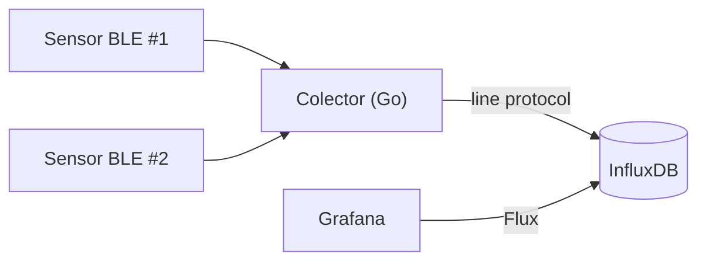

# CPD Monitor — Temperatura y humedad con Sensirion SHT4x + Go + InfluxDB + Grafana

Monitorización ambiental de un CPD (temperatura y humedad) usando dos
sensores **Sensirion SHT4x Smart Gadget** por Bluetooth Low Energy (BLE), un
colector escrito en **Go**, almacenamiento en **InfluxDB OSS 2.7** y
visualización en **Grafana**, todo autoalojado.

> 🔰 **¿Primera vez con este tipo de proyecto?** Este README es la referencia
> rápida. Si prefieres una guía que no da nada por sabido — desde comprobar
> que tienes Git instalado hasta ver los datos en Grafana — sigue
> [`docs/GUIA-DESDE-CERO.md`](docs/GUIA-DESDE-CERO.md).

📄 Guía completa para principiantes, de cero a producción: [`docs/GUIA-DESDE-CERO.md`](docs/GUIA-DESDE-CERO.md)
📄 Decisiones de diseño y por qué se ha elegido cada pieza: [`docs/ARQUITECTURA.md`](docs/ARQUITECTURA.md)
📄 Ideas para evolucionar el proyecto: [`docs/MEJORAS-FUTURAS.md`](docs/MEJORAS-FUTURAS.md)



---

## 0. Requisitos previos

**Hardware**

- 2× Sensirion SHT4x Smart Gadget (u otro gadget del mismo perfil, como el
  SHT31 Smart Gadget — comparten firmware/BLE).
- Un host Linux dentro o con visión Bluetooth del CPD (una Raspberry Pi 4,
  un mini-PC o un servidor ya existente), con Bluetooth 4.0+ integrado o un
  adaptador USB BLE.

**Software**

- Linux con **BlueZ** (viene de serie en Ubuntu/Debian/Raspberry Pi OS).
- **Go 1.22+** (`go version` para comprobarlo).
- **Docker** y **Docker Compose** (para InfluxDB y Grafana).
- Una cuenta de GitHub con una organización ya creada (la tienes).
- La app móvil **nRF Connect** (Android/iOS, gratuita) para el paso 1.

---

## 1. Identificar y verificar los sensores BLE

Antes de escribir nada, hay que confirmar la dirección MAC de cada sensor y
que expone los servicios BLE que el código espera.

1. Enciende el sensor (botón físico, según el modelo) y abre **nRF Connect**
   en tu móvil.
2. Pulsa **Scan** y busca un dispositivo llamado algo como `SHT4x Smart Gadget`
   o `Smart Humigadget`. Anota su **dirección MAC** (formato
   `AA:BB:CC:DD:EE:FF`) — la necesitarás en el paso 5.
3. Conéctate al dispositivo desde la app y comprueba que aparecen (entre
   otros) dos servicios/características con estos UUID:
   - `00001235-b38d-4985-720e-0f993a68ee41` → humedad
   - `00002235-b38d-4985-720e-0f993a68ee41` → temperatura

   Si tu unidad concreta expone UUID distintos (revisiones de firmware
   futuras podrían cambiarlos), anótalos: tendrás que sustituirlos en
   `internal/sensor/gadget.go` (constantes `uuidServicioHumedad` y
   `uuidServicioTemperatura`).
4. Repite con el segundo sensor y pon a cada uno una etiqueta física
   (una pegatina) indicando dónde vas a instalarlo — lo necesitarás para
   rellenar `ubicacion` en la configuración.

---

## 2. Preparar el host Linux

Instala BlueZ y comprueba que el adaptador Bluetooth del host funciona:

```bash
sudo apt update
sudo apt install -y bluez

# Debe listar tu adaptador (hci0) como "UP RUNNING"
hciconfig -a
```

Crea un usuario de sistema dedicado para ejecutar el colector (buena
práctica: nunca ejecutar servicios como root si no es necesario) y añádelo
al grupo `bluetooth`, imprescindible para poder hablar con BlueZ vía D-Bus:

```bash
sudo useradd --system --no-create-home --shell /usr/sbin/nologin cpdmonitor
sudo usermod -aG bluetooth cpdmonitor
```

---

## 3. Crear el repositorio en tu organización de GitHub

En tu máquina de desarrollo (con VSCode + WSL, tal como sueles trabajar):

```bash
mkdir cpd-monitor && cd cpd-monitor
git init
git branch -M main
```

Copia dentro de esta carpeta todos los ficheros de este proyecto (los tienes
en el `.zip` adjunto). Después:

```bash
git add .
git commit -m "Estructura inicial del proyecto: colector Go, docker-compose y dashboard de Grafana"
```

Crea el repositorio vacío en tu organización de GitHub (desde la web, sin
README ni licencia, para no chocar con lo que ya tienes) y enlázalo:

```bash
git remote add origin git@github.com:alexio9910/cpd-monitor.git
git push -u origin main
```

> Sustituye `alexio9910` aquí y en `go.mod` / `internal/store/influx.go`
> por el nombre real de tu organización de GitHub.

---

## 4. Levantar InfluxDB y Grafana

```bash
cp .env.example .env
```

Edita `.env` y rellena `INFLUXDB_ADMIN_PASSWORD`, `INFLUXDB_ADMIN_TOKEN`
(puedes generarlo con `openssl rand -hex 32`) y `GRAFANA_ADMIN_PASSWORD` con
valores propios — nunca dejes los de ejemplo.

```bash
make stack-up
# equivalente a: docker compose up -d
```

Comprueba que ambos servicios están arriba:

```bash
docker compose ps
```

- InfluxDB queda escuchando en `http://localhost:8086`
- Grafana queda escuchando en `http://localhost:3000` (usuario/contraseña:
  los que hayas puesto en `.env`)

Al entrar en Grafana, el datasource `InfluxDB-CPD` y el dashboard
**"CPD - Temperatura y Humedad"** ya deberían estar creados automáticamente
(aprovisionados desde `grafana/provisioning/`). Todavía no verás datos: eso
llega en el paso 6.

```bash
git add .env.example
git commit -m "Añade docker-compose para InfluxDB y Grafana, con datasource y dashboard aprovisionados"
git push
```

(`.env` real con tus secretos **no** se sube — está en `.gitignore`.)

---

## 5. Configurar el colector

```bash
cp config.example.yaml config.yaml
```

Edita `config.yaml`:

- `influxdb.token`: pon el mismo valor que `INFLUXDB_ADMIN_TOKEN` en `.env`
  (para empezar; en producción usa un token de solo lectura/escritura
  limitado — ver [`docs/MEJORAS-FUTURAS.md`](docs/MEJORAS-FUTURAS.md)).
- `influxdb.org` / `influxdb.bucket`: los mismos valores que pusiste en
  `.env`.
- `sensores`: sustituye las MAC de ejemplo por las MAC reales que anotaste
  en el paso 1, y `ubicacion` por dónde está físicamente cada sensor.

---

## 6. Compilar y probar el colector

```bash
make build
sudo ./bin/cpd-monitor -config config.yaml
```

(se ejecuta con `sudo` en esta prueba manual porque tu usuario normal
probablemente no está en el grupo `bluetooth`; en producción, el servicio
systemd del paso 7 se ejecuta como el usuario `cpdmonitor` que sí lo está).

Deberías ver por consola una línea cada 60 segundos por sensor, por ejemplo:

```
2026/08/11 10:15:03 [pasillo_frio_a] 21.40°C  45.2%HR  bateria=87%
```

Si ves un error, revisa la sección **Solución de problemas** más abajo.
Cuando funcione, para el proceso con `Ctrl+C` y sigue con el paso 7.

---

## 7. Desplegar como servicio systemd

```bash
sudo mkdir -p /opt/cpd-monitor
sudo cp bin/cpd-monitor config.yaml /opt/cpd-monitor/
sudo chown -R cpdmonitor:cpdmonitor /opt/cpd-monitor

sudo cp deploy/systemd/cpd-monitor.service /etc/systemd/system/
sudo systemctl daemon-reload
sudo systemctl enable --now cpd-monitor

# ver que arrancó bien:
sudo systemctl status cpd-monitor
journalctl -u cpd-monitor -f
```

A partir de aquí, el colector arranca solo con el sistema y se reinicia
automáticamente si falla (`Restart=on-failure` en la unidad systemd).

---

## 8. Verificar en Grafana

Entra en `http://localhost:3000` (o la IP del host), abre el dashboard
**"CPD - Temperatura y Humedad"** y confirma que, pasado un par de minutos,
ambos sensores aparecen con datos en los paneles de temperatura, humedad y
batería.

```bash
git add config.example.yaml deploy/ cmd/ internal/ go.mod docs/ Makefile .gitignore LICENSE .github/
git commit -m "Colector Go funcionando end-to-end: BLE -> InfluxDB -> Grafana"
git push
```

---

## Solución de problemas comunes

| Síntoma | Causa probable | Qué hacer |
|---|---|---|
| `no se pudo conectar con el sensor ...` | El sensor está fuera de alcance o su batería está agotada | Acércate con el móvil y nRF Connect para confirmar que sigue emitiendo |
| `no se pudieron descubrir los servicios BLE` | El firmware de tu unidad usa otros UUID | Repite el paso 1 y actualiza las constantes en `internal/sensor/gadget.go` |
| `Properties.GetAll org.bluez.Device1 ...` (error de D-Bus) | Problema conocido de BlueZ con dispositivos "fantasma" en su caché | `sudo bluetoothctl remove AA:BB:CC:DD:EE:FF` y vuelve a intentarlo |
| El colector no arranca como servicio pero sí a mano con `sudo` | El usuario `cpdmonitor` no está en el grupo `bluetooth`, o hace falta reiniciar sesión de D-Bus | Revisa el paso 2 y reinicia el host si el problema persiste |
| Grafana no tiene datos pero el colector no da error | El bucket/org del dashboard no coincide con los de tu `.env` | Edita `grafana/dashboards/cpd-temp-humedad.json` y sustituye `"cpd_monitorizacion"` por el nombre real de tu bucket |

---

## Seguridad — lo mínimo antes de considerarlo "producción"

- No subas nunca `config.yaml` ni `.env` reales a GitHub (ya están en
  `.gitignore`; revísalo si renombras algo).
- Sustituye el token de administrador de InfluxDB en Grafana por uno de
  solo lectura limitado al bucket (ver `docs/MEJORAS-FUTURAS.md`).
- Si vas a acceder a Grafana desde fuera de la red local, ponlo detrás de
  un proxy inverso con HTTPS (por ejemplo Caddy o Nginx + Let's Encrypt) en
  vez de exponer el puerto 3000 directamente.

---

## Estructura del repositorio

```
cpd-monitor/
├── cmd/collector/main.go        # punto de entrada del colector
├── internal/
│   ├── config/                  # carga de config.yaml
│   ├── sensor/                  # lectura BLE del Sensirion Smart Gadget
│   └── store/                   # escritura en InfluxDB
├── config.example.yaml
├── docker-compose.yml           # InfluxDB + Grafana
├── grafana/
│   ├── provisioning/            # datasource y proveedor de dashboards
│   └── dashboards/               # JSON del dashboard
├── deploy/systemd/               # unidad systemd del colector
├── deploy.sh                     # actualiza y reinicia todo en la Raspberry Pi
├── docs/
│   ├── GUIA-DESDE-CERO.md        # guía completa para principiantes
│   ├── ARQUITECTURA.md
│   └── MEJORAS-FUTURAS.md
└── .github/workflows/build.yml   # CI: compila y valida en cada push
```
