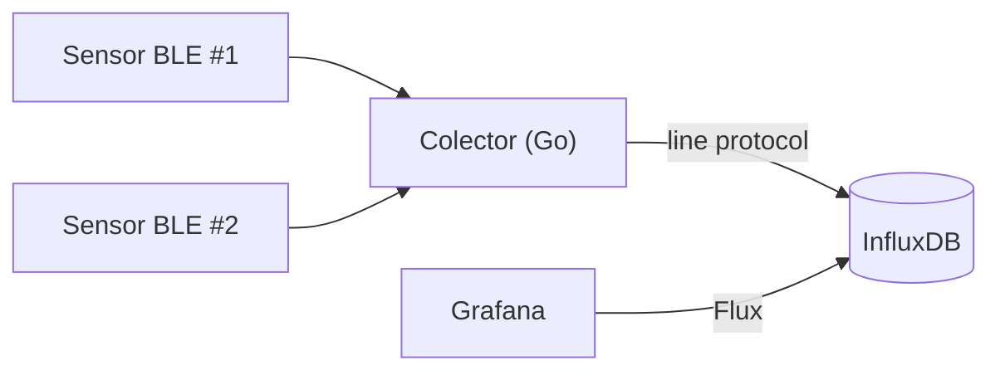

# CPD Monitor — Temperatura y humedad con Sensirion SHT4x + Go + InfluxDB + Grafana

Monitorización ambiental de un CPD (temperatura y humedad) usando dos
sensores **Sensirion SHT4x Smart Gadget** por Bluetooth Low Energy (BLE), un
colector escrito en **Go**, almacenamiento en **InfluxDB OSS 2.7** y
visualización en **Grafana**, todo autoalojado.

> 🔰 **¿Primera vez con este tipo de proyecto?** Este README es la referencia
> rápida. Si prefieres una guía que no da nada por sabido — desde comprobar
> que tienes Git instalado hasta ver los datos en Grafana — sigue
> [`docs/GUIA-DESDE-CERO.md`](docs/GUIA-DESDE-CERO.md).

📄 Guía completa para principiantes, de cero a producción: [`docs/GUIA-DESDE-CERO.md`](docs/GUIA-DESDE-CERO.md)
📄 **Manual de experto — usar, diagnosticar y modificar el sistema ya en marcha:** [`docs/MANUAL-EXPERTO.md`](docs/MANUAL-EXPERTO.md)
📄 Decisiones de diseño y por qué se ha elegido cada pieza: [`docs/ARQUITECTURA.md`](docs/ARQUITECTURA.md)
📄 Ideas para evolucionar el proyecto: [`docs/MEJORAS-FUTURAS.md`](docs/MEJORAS-FUTURAS.md)



---

## 0. Requisitos previos

**Hardware**

- 2× Sensirion SHT4x Smart Gadget (u otro gadget del mismo perfil, como el
  SHT31 Smart Gadget — comparten firmware/BLE).
- Un host Linux dentro o con visión Bluetooth del CPD (una Raspberry Pi 4,
  un mini-PC o un servidor ya existente), con Bluetooth 4.0+ integrado o un
  adaptador USB BLE.

**Software**

- Linux con **BlueZ** (viene de serie en Ubuntu/Debian/Raspberry Pi OS).
- **Go 1.22+** (`go version` para comprobarlo).
- **Docker** y **Docker Compose** (para InfluxDB y Grafana).
- Una cuenta de GitHub con una organización ya creada (la tienes).
- La app móvil **nRF Connect** (Android/iOS, gratuita) para el paso 1, si eliges esa opción.

---

## 1. Identificar y verificar los sensores BLE

Antes de escribir nada, hay que confirmar la dirección MAC de cada sensor y
que expone los servicios BLE que el código espera. Hay dos formas de
conseguirlo — elige la que te resulte más cómoda.

### Opción A — con el móvil, usando nRF Connect (solo Android)

1. Enciende el sensor (botón físico, según el modelo) y abre **nRF Connect**
   en tu móvil.
2. Pulsa **Scan** y busca un dispositivo llamado algo como `SHT4x Smart Gadget`
   o `Smart Humigadget`. Anota su **dirección MAC** (formato
   `AA:BB:CC:DD:EE:FF`).
3. Conéctate al dispositivo desde la app y comprueba que aparecen (entre
   otros) dos servicios/características con estos UUID:
   - `00001235-b38d-4985-720e-0f993a68ee41` → humedad
   - `00002235-b38d-4985-720e-0f993a68ee41` → temperatura

> ⚠️ **En iPhone esta opción no sirve**: iOS oculta la dirección MAC real
> de los dispositivos Bluetooth a todas las apps (restricción de privacidad
> de Apple), así que ninguna app te la va a dar ahí, ni siquiera nRF
> Connect. Si usas iPhone, ve directamente a la Opción B.

### Opción B — escaneando desde el propio host Linux (recomendado)

El colector va a leer los sensores desde el adaptador Bluetooth del host
(la Raspberry Pi u otro Linux con BlueZ), así que puedes obtener la MAC
directamente ahí, sin depender de ninguna app de móvil — y de paso
confirmas que el sensor tiene alcance real desde donde va a vivir el
colector:

```bash
bluetoothctl
scan on
```

Con el sensor encendido y cerca del host, irán apareciendo líneas con la
MAC de cada dispositivo BLE detectado alrededor; busca la que tenga un
nombre parecido a `SHT4x Smart Gadget` o `Smart Humigadget`. Anota su MAC
y sal del escaneo con:

```
scan off
exit
```

Los UUID de los servicios de humedad y temperatura (`00001235-...` y
`00002235-...`) son los que publica el propio firmware de Sensirion y
están confirmados de forma independiente por la comunidad — no hace falta
verificarlos a mano salvo que algo falle más adelante (ver la sección
**Solución de problemas**).

---

Si tu unidad concreta expone UUID distintos (revisiones de firmware
futuras podrían cambiarlos), tendrás que sustituirlos en
`internal/sensor/gadget.go` (constantes `uuidServicioHumedad` y
`uuidServicioTemperatura`).

Repite con cada sensor adicional y pon a cada uno una etiqueta física
(una pegatina) indicando dónde vas a instalarlo — lo necesitarás para
rellenar `ubicacion` en la configuración.

---

## 2. Preparar el host Linux

Instala BlueZ y comprueba que el adaptador Bluetooth del host funciona:

```bash
sudo apt update
sudo apt install -y bluez

# Debe listar tu adaptador (hci0) como "UP RUNNING"
hciconfig -a
```

Crea un usuario de sistema dedicado para ejecutar el colector (buena
práctica: nunca ejecutar servicios como root si no es necesario) y añádelo
al grupo `bluetooth`, imprescindible para poder hablar con BlueZ vía D-Bus:

```bash
sudo useradd --system --no-create-home --shell /usr/sbin/nologin cpdmonitor
sudo usermod -aG bluetooth cpdmonitor
```

---

## 3. Crear el repositorio en tu organización de GitHub

En tu máquina de desarrollo (con VSCode + WSL, tal como sueles trabajar):

```bash
mkdir cpd-monitor && cd cpd-monitor
git init
git branch -M main
```

Copia dentro de esta carpeta todos los ficheros de este proyecto (los tienes
en el `.zip` adjunto). Después:

```bash
git add .
git commit -m "Estructura inicial del proyecto: colector Go, docker-compose y dashboard de Grafana"
```

Crea el repositorio vacío en tu organización de GitHub (desde la web, sin
README ni licencia, para no chocar con lo que ya tienes) y enlázalo:

```bash
git remote add origin git@github.com:TU-ORGANIZACION/cpd-monitor.git
git push -u origin main
```

> Sustituye `TU-ORGANIZACION` aquí y en `go.mod` / `internal/store/influx.go`
> por el nombre real de tu organización de GitHub.

---

## 4. Levantar InfluxDB y Grafana

```bash
cp .env.example .env
```

Edita `.env` y rellena `INFLUXDB_ADMIN_PASSWORD`, `INFLUXDB_ADMIN_TOKEN`
(puedes generarlo con `openssl rand -hex 32`) y `GRAFANA_ADMIN_PASSWORD` con
valores propios — nunca dejes los de ejemplo.

```bash
make stack-up
# equivalente a: docker compose up -d
```

Comprueba que ambos servicios están arriba:

```bash
docker compose ps
```

- InfluxDB queda escuchando en `http://localhost:8086`
- Grafana queda escuchando en `http://localhost:3000` (usuario/contraseña:
  los que hayas puesto en `.env`)

Al entrar en Grafana, el datasource `InfluxDB-CPD` y el dashboard
**"CPD - Temperatura y Humedad"** ya deberían estar creados automáticamente
(aprovisionados desde `grafana/provisioning/`). Todavía no verás datos: eso
llega en el paso 6.

```bash
git add .env.example
git commit -m "Añade docker-compose para InfluxDB y Grafana, con datasource y dashboard aprovisionados"
git push
```

(`.env` real con tus secretos **no** se sube — está en `.gitignore`.)

---

## 5. Configurar el colector

```bash
cp config.example.yaml config.yaml
```

Edita `config.yaml`:

- `influxdb.token`: pon el mismo valor que `INFLUXDB_ADMIN_TOKEN` en `.env`
  (para empezar; en producción usa un token de solo lectura/escritura
  limitado — ver [`docs/MEJORAS-FUTURAS.md`](docs/MEJORAS-FUTURAS.md)).
- `influxdb.org` / `influxdb.bucket`: los mismos valores que pusiste en
  `.env`.
- `sensores`: sustituye las MAC de ejemplo por las MAC reales que anotaste
  en el paso 1, y `ubicacion` por dónde está físicamente cada sensor.

---

## 6. Compilar y probar el colector

```bash
make build
sudo ./bin/cpd-monitor -config config.yaml
```

(se ejecuta con `sudo` en esta prueba manual porque tu usuario normal
probablemente no está en el grupo `bluetooth`; en producción, el servicio
systemd del paso 7 se ejecuta como el usuario `cpdmonitor` que sí lo está).

Deberías ver por consola una línea cada 60 segundos por sensor, por ejemplo:

```
2026/08/11 10:15:03 [pasillo_frio_a] 21.40°C  45.2%HR  bateria=87%
```

> 💡 El **primer ciclo** puede tardar más de lo normal o incluso fallar con
> `tiempo de espera agotado resolviendo servicios BLE`: es la primera vez
> que BlueZ conecta con el sensor en esta sesión y tiene que recorrer todo
> su árbol de servicios GATT. A partir del segundo ciclo, con la conexión
> ya establecida y mantenida (ver `docs/ARQUITECTURA.md`), las lecturas
> deberían ser rápidas y estables.

Si ves un error persistente, revisa la sección **Solución de problemas**
más abajo. Cuando funcione, para el proceso con `Ctrl+C` y sigue con el
paso 7.

---

## 7. Desplegar como servicio systemd

```bash
sudo mkdir -p /opt/cpd-monitor
sudo cp bin/cpd-monitor config.yaml /opt/cpd-monitor/
sudo chown -R cpdmonitor:cpdmonitor /opt/cpd-monitor

sudo cp deploy/systemd/cpd-monitor.service /etc/systemd/system/
sudo systemctl daemon-reload
sudo systemctl enable --now cpd-monitor

# ver que arrancó bien:
sudo systemctl status cpd-monitor
journalctl -u cpd-monitor -f
```

A partir de aquí, el colector arranca solo con el sistema y se reinicia
automáticamente si falla (`Restart=on-failure` en la unidad systemd).

---

## 8. Verificar en Grafana

Entra en `http://localhost:3000` (o la IP del host), abre el dashboard
**"CPD - Temperatura y Humedad"** y confirma que, pasado un par de minutos,
ambos sensores aparecen con datos en los paneles de temperatura, humedad y
batería.

```bash
git add config.example.yaml deploy/ cmd/ internal/ go.mod docs/ Makefile .gitignore LICENSE .github/
git commit -m "Colector Go funcionando end-to-end: BLE -> InfluxDB -> Grafana"
git push
```

---

## 9. Añadir un sensor adicional

El colector no necesita recompilarse para añadir sensores: basta con editar
`config.yaml` y reiniciar el servicio.

1. **Identifica la MAC del sensor nuevo** (ver sección 1 — Opción B,
   `bluetoothctl scan on`, es la más fiable).
2. **Edita el `config.yaml` de trabajo** (el de `~/cpd-monitor/config.yaml`
   en el host, **no** `config.example.yaml`) y añade un bloque nuevo bajo
   `sensores:`, con un `id` distinto a los que ya tengas:

```yaml
   sensores:
     - id: "sensor1"
       mac: "E4:E9:00:CB:E2:DC"
       ubicacion: "Sensor 1"
     - id: "sensor2"
       mac: "AA:BB:CC:DD:EE:FF"   # sustituye por la MAC real
       ubicacion: "Sensor 2"       # sustituye por su ubicación real
```

3. **Copia el `config.yaml` actualizado a donde vive el servicio** y
   reinícialo (el servicio lee su copia en `/opt/cpd-monitor/`, no la de tu
   carpeta de trabajo):

```bash
   sudo cp config.yaml /opt/cpd-monitor/config.yaml
   sudo chown cpdmonitor:cpdmonitor /opt/cpd-monitor/config.yaml
   sudo systemctl restart cpd-monitor
```

4. **Verifica** que ambos sensores aparecen:

```bash
   journalctl -u cpd-monitor -f
```

   Deberías ver líneas para `sensor1` y `sensor2` en cada ciclo (el segundo
   sensor puede tardar un poco más en su primer ciclo, por el mismo motivo
   que el primero: BlueZ tiene que descubrirlo y resolver su árbol GATT).

5. Los dos paneles de gráfica (Temperatura, Humedad relativa) no
   necesitan ningún cambio: agrupan por `sensor_id`/`ubicacion`, así que
   el segundo sensor aparece solo como una línea nueva.

   Los tres paneles de "valor actual" (Temperatura actual, Humedad
   actual, Batería) sí están filtrados a propósito a un sensor concreto
   (para que muestren un número, no una mezcla ambigua de varios). Para
   crearlos para el segundo sensor, usa el script ya preparado para
   ello (ver `docs/MANUAL-EXPERTO.md`, sección 7.3):

````bash
   python3 scripts/anadir_sensor_dashboard.py sensor2 "Sensor 2"
   docker compose restart grafana
```

   Las reglas de alerta **no** necesitan tocarse — ver sección 10.

> `config.yaml` contiene tu token real de InfluxDB y nunca se sube a
> GitHub — este procedimiento no requiere ningún commit ni push, solo
> tocar el fichero local del host.

---

## 10. Seguridad y alertas

### Usuarios de Grafana

- **`admin`**: control total (edición de dashboards, datasources, usuarios). Es
  el que usas tú para administrar.
- **`visor`**: rol *Viewer* — puede ver dashboards y consultar datos, pero no
  puede editar ni borrar nada ni tocar la configuración. Pensado para dar
  acceso a un cliente o a cualquiera que solo necesite consultar las
  gráficas. Contraseña guardada en `.env` (`GRAFANA_VIEWER_PASSWORD`).

### Token de InfluxDB de solo lectura

El datasource de Grafana **no** usa el token de administrador de InfluxDB
(que sí usa el colector para escribir) — usa un token aparte
(`GRAFANA_INFLUXDB_TOKEN` en `.env`), creado con `influx auth create
--read-bucket`, con permiso **únicamente** de lectura sobre el bucket
`cpd_monitorizacion`. Así, nadie con acceso a Grafana (ni siquiera un
`admin` de Grafana comprometido) podría borrar el bucket de datos ni crear
usuarios nuevos en InfluxDB.

### Alertas por email

Configuradas dos reglas en Alerting → Alert rules (creadas desde la
interfaz, no por fichero, para poder ajustarlas con margen de prueba):

| Regla | Condición | Rango |
|---|---|---|
| Temperatura CPD fuera de rango | `temperatura_c` fuera de rango | 18-27 °C (orientativo ASHRAE TC9.9) |
| Humedad CPD fuera de rango | `humedad_rel_pct` fuera de rango | 40-60 %HR |

Ambas reglas están pensadas para avisar **lo antes posible** y cubrir tres
situaciones distintas, todas por email a las direcciones configuradas en
el contact point `email-cpd`:

1. **Sale de rango** → aviso inmediato (Periodo pendiente = Ninguno).
2. **Vuelve a rango** → aviso automático de "RESUELTA" (Seguir activando
   durante = Ninguno), sin lógica adicional: es el comportamiento nativo
   de Grafana al detectar que una alerta activa deja de cumplirse.
3. **El colector deja de mandar datos, o InfluxDB falla al consultar** →
   ambos casos configurados como `Alerting` en "Configurar la gestión de
   errores y falta de datos", así que un colector caído (Bluetooth roto,
   servicio parado, Pi apagada...) también dispara un aviso, sin depender
   de inferirlo por la ausencia de otro correo.

El grupo de evaluación (`Monitorizacion-CPD`) evalúa cada 10 segundos (el
mínimo permitido por Grafana), y la política de notificación
(`grafana/provisioning/alerting/policies.yaml`) agrupa con
`group_wait`/`group_interval` de 10s también, tanto para la alerta como
para el aviso de "resuelta" — antes este segundo margen estaba en 1
minuto por defecto y retrasaba el correo de vuelta a la normalidad. El
cuello de botella real para la velocidad ya no está en Grafana, sino en
el propio colector, que lee el sensor cada 60s: en la práctica, el email
llega en cuestión de segundos tras el siguiente ciclo de lectura.

La plantilla de email (en `contactpoints.yaml`) usa un formato reducido y
legible de un vistazo — valor con su unidad, rango normal, hora local del
evento (gracias a `TZ: Europe/Madrid`), enlace directo al dashboard — en
vez del volcado técnico que usa Grafana por defecto
(`{{ "{{ .ValueString }}" }}`).

Las consultas Flux de ambas reglas **no filtran por sensor concreto** a
propósito: al mantener `sensor_id`/`ubicacion` como columnas (`keep()`),
InfluxDB devuelve una fila por sensor y Grafana evalúa cada una como una
alerta independiente — es decir, **añadir un segundo sensor no requiere
tocar las reglas de alerta**, se cubre automáticamente en cuanto empiece a
escribir datos (ver sección 9).

Grafana está configurado con `TZ: Europe/Madrid` (variable de entorno del
contenedor) para que las horas de los emails de alerta coincidan con la
hora local, no con UTC.

---

## Solución de problemas comunes

| Síntoma | Causa probable | Qué hacer |
|---|---|---|
| `no se pudo conectar con el sensor ...` | El sensor está fuera de alcance o su batería está agotada | Acércate y comprueba con `bluetoothctl scan on` que sigue emitiendo |
| `no se pudieron descubrir los servicios BLE` / `no expone las características ... esperadas` | El firmware de tu unidad usa otros UUID | Conéctate con `bluetoothctl` (`connect <MAC>` → `menu gatt` → `list-attributes <MAC>`) y compara con las UUID de `internal/sensor/gadget.go` |
| `tiempo de espera agotado resolviendo servicios BLE del sensor ...` | Es la primera vez que BlueZ conecta con ese sensor en esta sesión (tras reiniciar el host o el servicio `bluetooth`) y tarda en recorrer todo su árbol GATT | Normal en el primer ciclo tras un arranque; si persiste en ciclos posteriores, sube `timeout_conexion_segundos` en `config.yaml` |
| `Method "Get"/"Connect" ... doesn't exist` (error de D-Bus) | Bug de compatibilidad conocido entre BlueZ reciente (≥5.55) y ciertas librerías BLE de abstracción — por eso el colector habla con BlueZ directamente por D-Bus (ver `docs/ARQUITECTURA.md`) | Si aún así aparece, `sudo systemctl restart bluetooth` y deja que el colector redescubra el sensor en el siguiente ciclo |
| El colector no arranca como servicio pero sí a mano con `sudo` | El usuario `cpdmonitor` no está en el grupo `bluetooth`, o hace falta reiniciar sesión de D-Bus | Revisa el paso 2 y reinicia el host si el problema persiste |
| Grafana no tiene datos pero el colector no da error | El bucket/org del dashboard no coincide con los de tu `.env` | Edita `grafana/dashboards/cpd-temp-humedad.json` y sustituye `"cpd_monitorizacion"` por el nombre real de tu bucket |

---

## Seguridad — lo mínimo antes de considerarlo "producción"

- No subas nunca `config.yaml` ni `.env` reales a GitHub (ya están en
  `.gitignore`; revísalo si renombras algo).
- ✅ El datasource de Grafana usa un token de InfluxDB de **solo
  lectura** (`GRAFANA_INFLUXDB_TOKEN`), no el de administrador — ver
  `docs/MANUAL-EXPERTO.md` sección 6.
- ✅ Existe un usuario `visor` en Grafana (rol Viewer) para dar acceso de
  solo consulta sin poder editar ni configurar nada — ver
  `docs/MANUAL-EXPERTO.md` sección 6.
- Si vas a acceder a Grafana desde fuera de la red local, ponlo detrás de
  un proxy inverso con HTTPS (por ejemplo Caddy o Nginx + Let's Encrypt) en
  vez de exponer el puerto 3000 directamente.

---

## Estructura del repositorio

```
cpd-monitor/
├── cmd/collector/main.go        # punto de entrada del colector
├── internal/
│   ├── config/                  # carga de config.yaml
│   ├── sensor/                  # lectura BLE (habla con BlueZ por D-Bus)
│   └── store/                   # escritura en InfluxDB
├── scripts/
│   └── anadir_sensor_dashboard.py  # añade los paneles de un sensor nuevo
├── config.example.yaml
├── docker-compose.yml           # InfluxDB + Grafana
├── grafana/
│   ├── provisioning/
│   │   ├── datasources/          # datasource InfluxDB (token solo lectura)
│   │   ├── dashboards/           # proveedor del dashboard
│   │   └── alerting/             # contact point (email) y política
│   └── dashboards/               # JSON del dashboard
├── deploy/systemd/               # unidad systemd del colector
├── deploy.sh                     # actualiza y reinicia todo en la Raspberry Pi
├── docs/
│   ├── GUIA-DESDE-CERO.md        # guía completa para principiantes
│   ├── MANUAL-EXPERTO.md         # manual de uso, diagnóstico y modificación
│   ├── ARQUITECTURA.md
│   └── MEJORAS-FUTURAS.md
└── .github/workflows/build.yml   # CI: compila y valida en cada push
```
