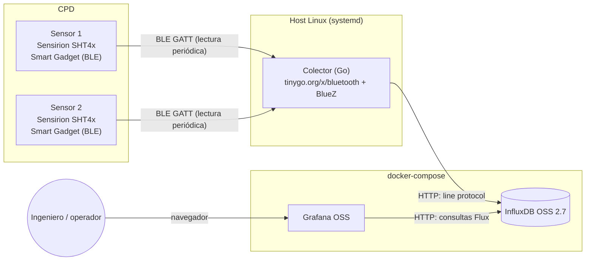

# Arquitectura

## Diagrama general

## Por qué esta pila y no otra

| Decisión | Alternativas consideradas | Por qué esta opción |
|---|---|---|
| **Go para el colector** | Python (bleak), Node.js (noble) | Es lo que pediste. Además: binario único sin runtime que instalar, bajo consumo de memoria para un proceso que va a vivir permanentemente en un host del CPD, y buena librería BLE multiplataforma (`tinygo.org/x/bluetooth`). |
| **InfluxDB OSS 2.7 (no InfluxDB 3 Core)** | InfluxDB 3 Core, Prometheus + Pushgateway, TimescaleDB | InfluxDB 3 Core (la versión más nueva) **limita las consultas a un rango de 72 horas** en su edición gratuita, algo pensado para observabilidad de infraestructura a corto plazo, no para el histórico de meses que interesa en un CPD (tendencias estacionales, auditorías, capacity planning). InfluxDB 2.7 no tiene esa limitación, es estable, madura y tiene soporte nativo y muy pulido en Grafana. Ver [docs/MEJORAS-FUTURAS.md](MEJORAS-FUTURAS.md) para cuándo sí tendría sentido migrar a v3. |
| **Grafana OSS auto-alojado** | Grafana Cloud | Coherente con que quieres todo self-hosted y sin dependencias externas. |
| **El colector NO va en Docker** | Contenerizar todo, incluido el colector | BLE en Linux requiere hablar con BlueZ vía D-Bus y acceder al adaptador Bluetooth del host. Es *posible* hacerlo desde un contenedor (montando el socket de D-Bus y usando `network_mode: host`), pero añade complejidad de permisos que no aporta nada en una primera versión. El colector se despliega como servicio `systemd` nativo; InfluxDB y Grafana sí se benefician de Docker porque no tocan hardware. |
| **Conectar-leer-desconectar en cada ciclo, sin mantener conexión BLE persistente** | Mantener conexión abierta y suscribirse a notificaciones | Con una lectura cada 60 s, mantener la conexión abierta no ahorra apenas nada y sí añade complejidad (gestionar cortes de conexión, reconexión, notificaciones "colgadas"). Conectar-leer-desconectar es más simple y, si un ciclo falla, el siguiente se recupera solo. |
| **Todas las operaciones BLE serializadas con un mutex** | Una gorutina/conexión concurrente por sensor | BlueZ, a través de D-Bus, no está pensado para atender varias operaciones GATT concurrentes sobre el mismo adaptador físico de forma fiable (es una fuente habitual de errores intermitentes reportados en la propia librería). Con dos sensores y un ciclo de 60 s, serializar las lecturas (tardan del orden de 1-2 s cada una) no supone ningún problema de rendimiento. |
| **Una única *measurement* (`cpd_ambiente`) con tags `sensor_id`/`ubicacion`** | Una measurement por sensor | Permite comparar sensores entre sí en Grafana con una sola consulta Flux, y añadir un tercer, cuarto o quinto sensor en el futuro sin tocar ni el dashboard ni el esquema. |

## Formato de los datos en InfluxDB

- **Measurement:** `cpd_ambiente`
- **Tags** (indexados, para filtrar/agrupar): `sensor_id`, `ubicacion`
- **Fields** (los valores en sí): `temperatura_c` (float), `humedad_rel_pct` (float), `bateria_pct` (int, opcional)

## Perfil BLE del Sensirion Smart Gadget

El SHT4x Smart Gadget expone, entre otras, estas características GATT:

| Magnitud | UUID | Formato |
|---|---|---|
| Humedad relativa | `00001235-b38d-4985-720e-0f993a68ee41` | float32 little-endian, en % |
| Temperatura | `00002235-b38d-4985-720e-0f993a68ee41` | float32 little-endian, en °C |
| Batería | `00002A19-0000-1000-8000-00805f9b34fb` (UUID estándar Bluetooth 0x2A19) | uint8, en % |

Estos UUID proceden del firmware oficial que Sensirion publica en abierto
(`github.com/Sensirion/SmartGadget-Firmware`) y están confirmados de forma
independiente leyendo el dispositivo real con `gatttool`/nRF Connect por
varios proyectos de la comunidad. Aun así, el paso 1 del README (escanear tu
sensor concreto con nRF Connect) existe para que verifiques estos UUID contra
tu unidad física antes de darlos por buenos a ciegas.
