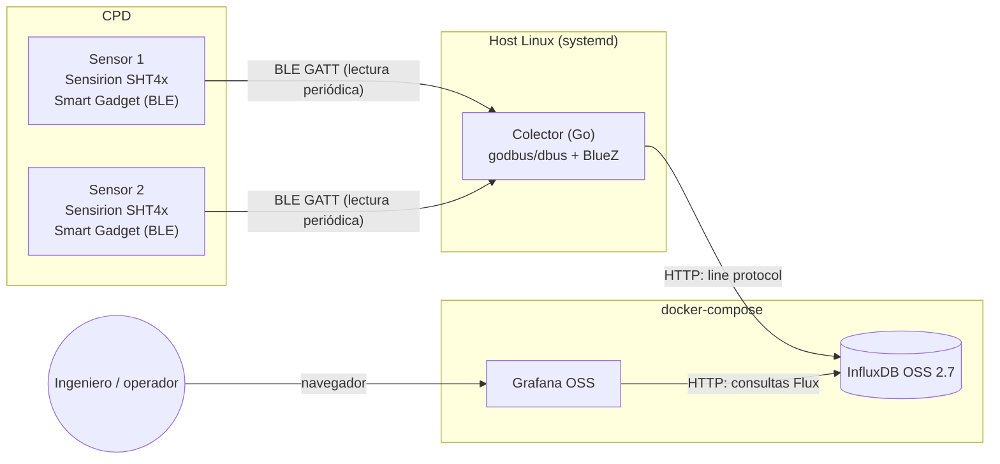

# Arquitectura

## Diagrama general

## Por qué esta pila y no otra

| Decisión | Alternativas consideradas | Por qué esta opción |
|---|---|---|
| **Go para el colector** | Python (bleak), Node.js (noble) | Binario único sin runtime que instalar, y bajo consumo de memoria para un proceso que va a vivir permanentemente en un host del CPD. (La idea inicial pasaba por la librería `tinygo.org/x/bluetooth`, pero se descartó más adelante por incompatibilidad con BlueZ reciente — ver la fila "Hablar con BlueZ directamente por D-Bus" más abajo). |
| **InfluxDB OSS 2.7 (no InfluxDB 3 Core)** | InfluxDB 3 Core, Prometheus + Pushgateway, TimescaleDB | InfluxDB 3 Core (la versión más nueva) **limita las consultas a un rango de 72 horas** en su edición gratuita, algo pensado para observabilidad de infraestructura a corto plazo, no para el histórico de meses que interesa en un CPD (tendencias estacionales, auditorías, capacity planning). InfluxDB 2.7 no tiene esa limitación, es estable, madura y tiene soporte nativo y muy pulido en Grafana. Ver [docs/MEJORAS-FUTURAS.md](MEJORAS-FUTURAS.md) para cuándo sí tendría sentido migrar a v3. |
| **Grafana OSS auto-alojado** | Grafana Cloud | Coherente con que quieres todo self-hosted y sin dependencias externas. |
| **El colector NO va en Docker** | Contenerizar todo, incluido el colector | BLE en Linux requiere hablar con BlueZ vía D-Bus y acceder al adaptador Bluetooth del host. Es *posible* hacerlo desde un contenedor (montando el socket de D-Bus y usando `network_mode: host`), pero añade complejidad de permisos que no aporta nada en una primera versión. El colector se despliega como servicio `systemd` nativo; InfluxDB y Grafana sí se benefician de Docker porque no tocan hardware. |
| **Hablar con BlueZ directamente por D-Bus (`github.com/godbus/dbus`)** | Librería de abstracción `tinygo.org/x/bluetooth` | La librería de abstracción es más cómoda, pero tiene un bug de compatibilidad conocido y sin resolver con BlueZ ≥5.55 que provoca fallos de conexión intermitentes (`Method "Get"/"GetAll" ... doesn't exist`, ver [issue #118](https://github.com/tinygo-org/bluetooth/issues/118)) — detectado en esta misma Raspberry Pi, con BlueZ 5.82. Hablar con BlueZ directamente por D-Bus, el mismo mecanismo que usa `bluetoothctl` (con el que la conexión sí es fiable), es más código pero evita el problema por completo. |
| **Conexión BLE persistente por sensor, con reconexión automática si se corta** | Conectar-leer-desconectar en cada ciclo (decisión original de la v1) | En la práctica, desconectar en cada ciclo resultó ser la causa de fallos intermitentes: BlueZ tiene que re-resolver el árbol GATT completo del sensor (~15 servicios) en cada reconexión, lo cual a veces superaba el timeout. Mantener la conexión abierta mientras el colector esté vivo evita ese coste repetido; si una lectura falla, se asume que la conexión se cortó de verdad y se reestablece en el siguiente ciclo. |
| **Auto-descubrimiento del sensor si BlueZ no lo conoce todavía** | Asumir que el sensor ya está en la caché de BlueZ | Tras reiniciar el host o el servicio `bluetooth`, BlueZ no tiene memoria de ningún sensor. El colector comprueba esto antes de conectar y, si hace falta, lanza un escaneo BLE breve él solo (equivalente a `bluetoothctl scan on`), para que el servicio funcione sin intervención manual tras cada reinicio. |
| **Token de InfluxDB separado (solo lectura) para Grafana** | Reutilizar el token de administrador en el datasource de Grafana | El datasource solo necesita leer. Usar el token de admin le daría permisos de sobra (borrar buckets, crear usuarios...) a cualquiera con acceso a la configuración de Grafana. Un token `--read-bucket` limita el daño posible al mínimo. |
| **Reglas de alerta sin filtrar por sensor, dejando `sensor_id`/`ubicacion` como columnas** | Una regla de alerta por sensor | Al no filtrar, InfluxDB devuelve una fila por sensor y Grafana la evalúa como una alerta independiente por sí solo. Añadir un sensor nuevo no requiere tocar ni una regla de alerta — se cubre automáticamente. |
| **`Alert state if no data / error = Alerting`** en las reglas | Dejar el valor por defecto (`No Data` / `Error`, que no notifican) | Un colector caído (Bluetooth roto, servicio parado, Pi apagada) es exactamente el tipo de fallo que más interesa detectar en un CPD, y por defecto Grafana no avisa de eso. Tratarlo como `Alerting` lo convierte en un watchdog del propio colector, sin lógica adicional. |
| **Todas las operaciones BLE serializadas con un mutex** | Una gorutina/conexión concurrente por sensor | BlueZ, a través de D-Bus, no está pensado para atender varias operaciones GATT concurrentes sobre el mismo adaptador físico de forma fiable (es una fuente habitual de errores intermitentes reportados en la propia librería). Con dos sensores y un ciclo de 60 s, serializar las lecturas (tardan del orden de 1-2 s cada una) no supone ningún problema de rendimiento. |
| **Una única *measurement* (`cpd_ambiente`) con tags `sensor_id`/`ubicacion`** | Una measurement por sensor | Permite comparar sensores entre sí en Grafana con una sola consulta Flux, y añadir un tercer, cuarto o quinto sensor en el futuro sin tocar ni el dashboard ni el esquema. |
| **Arranque del colector con espera activa a InfluxDB** (`ExecStartPre=wait-for-influxdb.sh` + `healthcheck`/`depends_on: condition: service_healthy` en `docker-compose.yml`) | Confiar en `Restart=on-failure` para recuperarse solo tras un primer fallo | Verificado con una prueba de reinicio real: sin esta espera activa, el colector arrancaba antes de que InfluxDB estuviera lista dentro de su contenedor, fallaba el primer intento (`restart counter is at 1` en los logs) y se recuperaba solo en segundos — funcional, pero no un arranque limpio. Con la espera activa, el colector solo arranca cuando InfluxDB responde de verdad: arranque limpio confirmado (`ExecStartPre ... status=0/SUCCESS`, sin reintentos) en pruebas reales de apagado/encendido. |
| **Misma zona horaria (`TZ: Europe/Madrid`) en todos los contenedores** (Grafana e InfluxDB) | Dejar InfluxDB en UTC (su valor por defecto) | InfluxDB guarda sus datos siempre en UTC internamente — esto no cambia con este ajuste, y **no** fue la causa de ninguna alerta con hora incorrecta (esa tuvo otra causa, ver `docs/MANUAL-EXPERTO.md` sección 9). Es una mejora de coherencia: evita confusión al inspeccionar logs o ejecutar comandos directamente dentro del contenedor de InfluxDB, que antes mostraba una hora distinta a la del resto del sistema. |

## Formato de los datos en InfluxDB

- **Measurement:** `cpd_ambiente`
- **Tags** (indexados, para filtrar/agrupar): `sensor_id`, `ubicacion`
- **Fields** (los valores en sí): `temperatura_c` (float), `humedad_rel_pct` (float), `bateria_pct` (int, opcional)

## Perfil BLE del Sensirion Smart Gadget

El SHT4x Smart Gadget expone, entre otras, estas características GATT:

| Magnitud | UUID | Formato |
|---|---|---|
| Humedad relativa | `00001235-b38d-4985-720e-0f993a68ee41` | float32 little-endian, en % |
| Temperatura | `00002235-b38d-4985-720e-0f993a68ee41` | float32 little-endian, en °C |
| Batería | `00002A19-0000-1000-8000-00805f9b34fb` (UUID estándar Bluetooth 0x2A19) | uint8, en % |

Estos UUID proceden del firmware oficial que Sensirion publica en abierto
(`github.com/Sensirion/SmartGadget-Firmware`) y están confirmados de forma
independiente leyendo el dispositivo real con `gatttool`/nRF Connect por
varios proyectos de la comunidad. Aun así, la Fase 5 de `docs/GUIA-DESDE-CERO.md` (escanear tu sensor
concreto) existe para que verifiques estos UUID contra tu unidad física
antes de darlos por buenos a ciegas.
